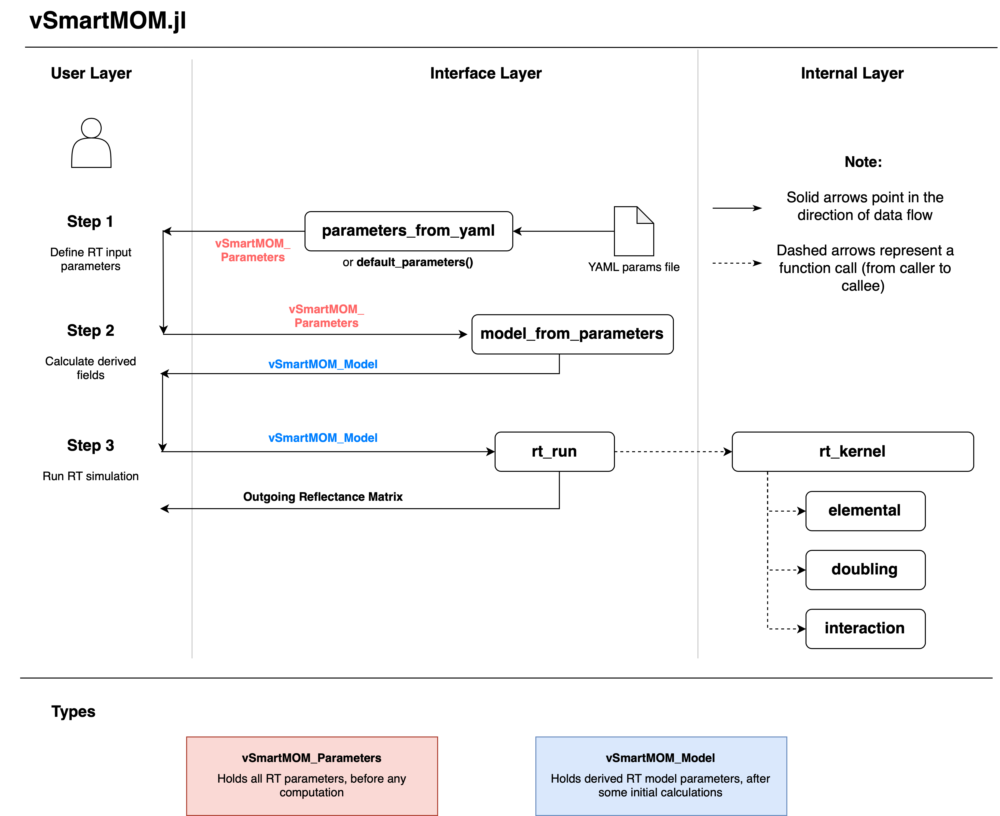

# RadiativeTransfer Module Overview

The RadiativeTransfer module allows end-to-end simulation of radiative transfer (RT) throughout Earth's atmosphere and surface. The model we use is based on the vSmartMOM Specifically, it:

- Enables 1D vectorized plane-parallel RT modeling based on the Matrix Operator Method
- Incorporates fast, high fidelity simulations of scattering atmospheres containing haze and clouds, including pressure- and temperature-resolved absorption profiles of gaseous species in the atmosphere
- Enables GPU-accelerated computations of the resulting hyperspectral reflectances/transmittances
- Enables auto-differentiation of the output spectrum with respect to various input parameters

You can perform an RT simulation in a few short steps: 

1. Use [`parameters_from_yaml`](@ref) or [`default_parameters`](@ref) to load a set of RT input parameters. You can modify any parameter in the returning [`vSmartMOM_Parameters`](@ref) struct (it is mutable). Please see the parameters [guide](https://radiativetransfer.github.io/RadiativeTransfer.jl/dev/pages/RadiativeTransfer/InputParametersGuide/) for more information on what each field specifies. 
2. Use [`model_from_parameters`](@ref) to calculate derived fields (ex. aerosol optical parameters, quadrature points, etc.). Again, any parameter in the output [`vSmartMOM_Model`](@ref) can be modified after the struct is created. 
3. Use [`rt_run`](@ref) to perform the radiative transfer calculation using the defined model settings. 

For a full demo of how to use this module, please see the [example](https://radiativetransfer.github.io/RadiativeTransfer.jl/dev/pages/RadiativeTransfer/Example/) page. 

## Architecture

