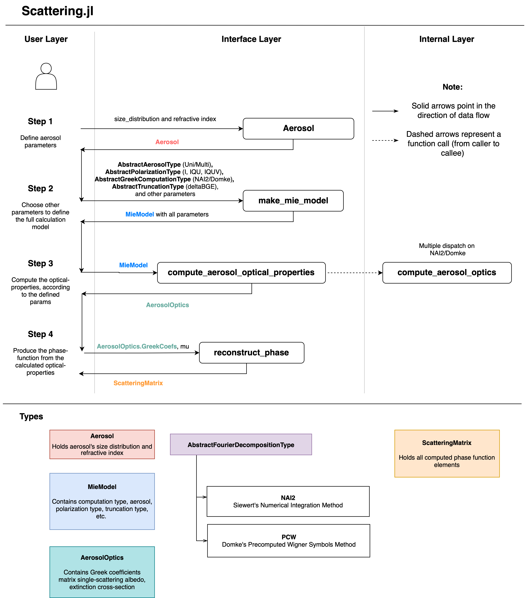

# Scattering Module Overview

This module enables scattering phase-function calculation of atmospheric aerosols with different size distributions, incident wavelengths, and refractive indices. It can perform the calculation using either the Siewert NAI-2 or Domke PCW methods ([Suniti Sanghavi 2014](https://www.sciencedirect.com/science/article/pii/S0022407313004962)). 

The module also supports auto-differentiation (AD) of the phase function, with respect to the aerosol's size distribution parameters and its refractive index. 

You can calculate a scattering phase-function in a few short steps: 

1. Use [`Aerosol`](@ref) to create an aerosol with selected distribution and properties
2. Use [`make_mie_model`](@ref) to set up all calculation parameters
3. Use [`compute_aerosol_optical_properties`](@ref) to perform the optical-properties calculations using the defined model settings
4. Use [`reconstruct_phase`](@ref) to produce the scattering matrix from the computed optical properties

For a full demo of how to use this module, please see the [example](https://radiativetransfer.github.io/RadiativeTransfer.jl/dev/pages/Scattering/Example/) page. 

## Architecture

The Scattering.jl architecture closely follows the user's workflow to calculate the scattering phase-function. There are functions for creating an aerosol, defining scattering parameters, calculating aerosol optical properties, and constructing the phase-function from said optical properties. 

The aerosol optical properties contain computed "Greek Coefficients", which are to be multiplied by matrices composed of generalized spherical functions, in order to produce the phase-functions. Since calculating the Greek Coefficients is the most computationally-intensive part – and the output phase-function can be produced at various resolutions – the [`reconstruct_phase`](@ref) function is separate from [`compute_aerosol_optical_properties`](@ref). 